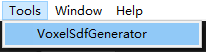

## 使用说明

### 概述

这是一个关于mesh的voxel和sdf信息的批量生成和可视化工具。

入口：     

##                               

界面：

### 参数

Options:选择生成voxel还是sdf还是both（都生成）

Mesh:选择要生成的Mesh

resolution:选择要生成的分辨率

是否填满：对voxel填1选择将其mesh所在的包围盒填满voxel，默认为0，即只在有三角形的区域填充体素。

processPath:选择要处理的目录，目录下所有的mesh都将进行处理

savePath：选择要保存的路径

loadPath：将体素化的mesh加载到场景内

有关工具界面部分的代码在VoxelSdfGenerator.cs里

## voxel

### 生成

一开始是使用pixel shader的生成（与视角方向相关，已被弃用），后来采用compute shader进行生成，有关voxel生成部分的代码在VoxelGenerator.cs里，里面调用了GenVoxel.compute，GenVoxel会为每一个三角形分配一个线程，然后每个三角形的包围盒内会做体素与三角形的aabb三角形求交，如果相交则记录voxel信息。aabb-三角形相交判断采用SAT定理判断十三个轴。

voxel生成的性能有待优化：因为每个三角形都会在包围盒内进行相交测试，即使该位置的体素已经生成过了，所以会有很多次重复判断。

可能的优化：采用树型结构如BVH将三角形组织起来，然后采用voxel与BVH进行相交判断，对每个voxel分配一个线程，但这样会导致负载不均衡，因为每个voxel与BVH相交运行的时间差异可能比较大，可以考虑以voxel和bvh节点作为键值对作为队列元素入队，然后每次线程从队列里取元素进行相交测试。

### 序列化

voxel相关数据结构在Voxel.cs与VoxelData.cs里

目前存了这么几个信息，还有压缩空间

### 可视化

读取voxel文件并将每个体素用一个6个平面的正方体mesh进行表示并重建。

## sdf

### 生成

相关代码在SdfGenerator.cs和GenSdf.compute里，SdfGenarator生成后会返回一个Texture3D带有sdf的信息。

GenSdf.compute里会为每一个体素分配一个线程，每个体素会发射线找到最近的三角形的距离，作为当前的sdf值。而sdf的正负号会通过打中的三角形的正反面的比例来判断正负。

性能上还存在优化空间，因为三角形是暴力遍历的

可能的优化：

1.采用BVH加速求交

2.使用JFA

### 可视化

可视化相关代码在VisualizeSdf.shader，需要新建一个material并绑上这个shader，他会把texture3D放到一个cube里，然后把camera及对应的cube转到object space再进行ray marching，步长采用sdf值，迭代64次或sdf绝对值小于阈值时停止。

